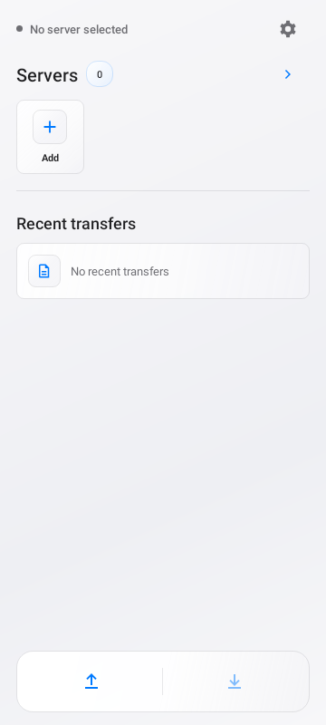
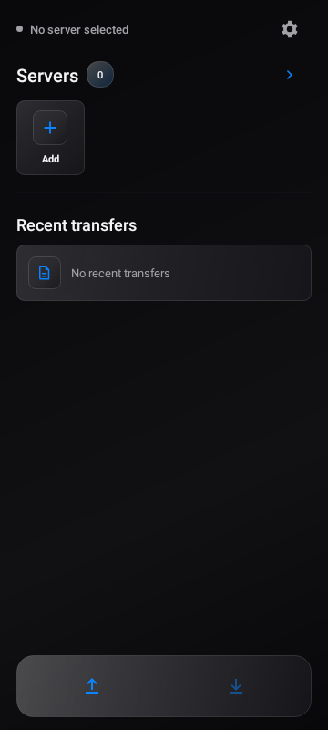
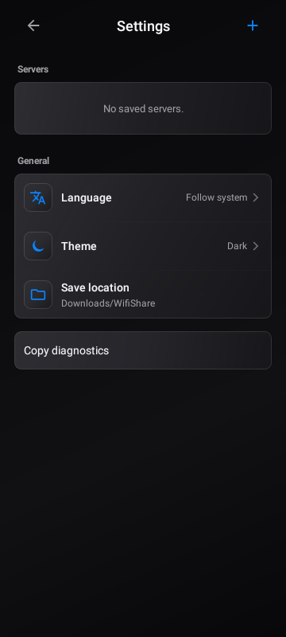

<p>
  
</p>

# WifiShare

Android 手机与 Linux 电脑之间的局域网文件互传工具。文件通过 HTTPS 直传，不经过云端中转。

- 手机选择文件或使用系统分享，确认后发送到电脑。
- 电脑执行 `phone <文件>` 加入队列，手机通过 App 或桌面小组件接收。
- 支持多服务器、发送前任务管理、中英文，以及跟随系统的明暗主题。

[快速开始](#quickstart) · [日常使用](#usage) · [故障排查](docs/troubleshooting.md) · [服务端指南](server/README.md) · [更新日志](CHANGELOG.md)

## 支持范围

| 端 | 当前范围 |
| --- | --- |
| 手机 | Android 10 及以上；Kotlin 原生 App |
| 电脑 | Linux；Python 服务端、OpenSSL；systemd 为可选项 |
| Windows / macOS | 暂无受支持的原生安装流程，未完成平台验证 |
| 网络 | 手机与电脑在可互访的可信局域网；电脑可使用有线连接 |

## 界面预览

<p>
  
  
  
</p>

以上为 `0.12.4` 实际 Activity 的 Robolectric 离屏渲染，展示未配对状态，不是设计稿或三星真机截图。
生成方法见[开发指南](docs/development.md#ui-previews)。

<a id="download"></a>
## 安装包与升级

当前文档对应 Android `0.12.4`（`versionCode 25`），包名为 `io.iaw.lanshare`。

[下载 WifiShare 0.12.4 正式 APK](https://github.com/iawnix/WifiShare/raw/refs/heads/main/android/WifiShare-v0.12.4-release.apk)
（6.46 MiB，6,775,956 字节）。也可从仓库中的
[`android/WifiShare-v0.12.4-release.apk`](android/WifiShare-v0.12.4-release.apk) 获取。
该版本包含 `0.12.1` 至 `0.12.4` 的累积修复；中间版本 APK 不另行收录。
源码与安装包随 Git 仓库提供，不依赖单独的 GitHub Release；自行构建见[开发指南](docs/development.md)。

APK SHA-256：

```text
97ef9172bb20eb08f56a8628208e32468e7f77dbcdc88ccca33e30015f015856
```

- 正式版 `0.12.0` 至 `0.12.4` 使用同一发布证书，可覆盖升级并保留配对与诊断记录。
- 更早版本、Debug 包或自行签名的 APK 可能签名不同，不能直接覆盖。卸载会清除配对与诊断数据，先看[升级与签名](docs/troubleshooting.md#upgrade)。
- “非 Debug”不等于“使用同一发布证书”；不要混装不同来源的签名版本。

<a id="quickstart"></a>
## 快速开始

以下为 Linux 首次安装流程，命令使用 Bash / Zsh。已有服务端请看[维护说明](server/README.md#maintenance)，不要重复初始化。

### 1. 准备电脑

准备 Python 3.13 或更新版本及 OpenSSL。找到手机能访问到的电脑 IPv4 地址：

```bash
python3 --version
openssl version
ip -4 addr
```

下文以 `192.168.1.50` 为例，请替换为实际局域网地址，不要用 `127.0.0.1`。
防火墙仅向可信局域网放行 `8443/tcp`；访客 Wi-Fi 或 AP 隔离可能阻止设备互访。

### 2. 安装服务端

```bash
git clone https://github.com/iawnix/WifiShare.git
cd WifiShare
./install_wifishare --ip 192.168.1.50 --shell bash
```

此后本节命令均以这个仓库根目录为起点；Zsh 用户把 `--shell bash` 改为 `--shell zsh`。
安装器会写入本机配置、证书、设备 Token 摘要和 shell 加载入口，并在终端输出配对信息。
电脑接收目录默认为 `~/Downloads/WifiShare`。Fish、自定义目录和后台运行见[服务端指南](server/README.md)。

**只在首次安装时执行上面的 `--ip` 命令。** 对已有安装再次指定 `--ip` 会重建证书并重置 Token，需要重新配对。

### 3. 启动服务端

```bash
. ~/.config/wifishare/env.sh
serve
```

保持这个终端运行；`serve` 会占用终端。需要执行其他命令时另开一个终端。
默认安装不启用后台服务，也不要在已经运行 systemd 服务时重复执行 `serve`。

### 4. 安装 App 并配对

安装[当前正式 APK](#download)，通过可信通道把安装器输出的 `Pairing URI` 传到手机并打开。
在 App 中核对服务器地址与证书指纹，确认后保存。每台电脑应独立初始化，不要复制另一台电脑的凭据。

链接不能打开时，可在首页加号或设置中新增服务器，填写 `Base URL`、`认证 Token` 和 `Cert SHA-256`。
配对 URI 含长期凭据，配对后删除传递副本，不要贴到公开 Issue 或在线二维码网站。

### 5. 完成第一次传输

手机到电脑：点击首页底部左侧上传箭头，选择文件，在确认页检查目标并发送。
也可以从文件管理器或相册的系统分享菜单选择 WifiShare。

电脑到手机：另开终端，加载命令并加入文件：

```bash
. ~/.config/wifishare/env.sh
phone "/path/to/file.pdf"
```

将示例路径替换为实际文件，然后点击手机首页底部右侧下载箭头。
`phone` 只负责排队，不会主动唤醒手机。文件保存到手机的 `Downloads/WifiShare/`。

<a id="usage"></a>
## 日常使用

| 任务 | 操作与规则 |
| --- | --- |
| 管理待发送文件 | 发送确认页可逐项移除，或取消整份草稿；源文件不会删除 |
| 停止发送 | 在发送页或通知中停止；已完整发送到电脑的文件不会撤回 |
| 切换服务器 | 点击服务器项确认切换；横向浏览不会改变当前目标，传输期间禁止切换 |
| 添加服务器 | 首页加号或设置中新增；从首页进入编辑，返回时回到首页 |
| 桌面小组件 | 添加时无需配置页，直接使用 App 当前服务器；点服务器区域选择目标，点下载图标接收 |
| 同步设置 | App 与所有小组件共用当前服务器、语言和主题，没有独立的小组件外观设置 |
| 语言与主题 | 设置中选择跟随系统 / 简体中文 / English，以及跟随系统 / 浅色 / 深色 |

首页按钮只有图标，长按可查看名称，也保留了无障碍描述。
设置中的保存位置展示手机当前接收目录，不提供自定义目录选择。

## 常见问题

- [App 闪退，无法进入设置，如何导出诊断？](docs/troubleshooting.md#diagnostics)
- [Token 在哪里设置？重启后需要重新生成吗？](server/README.md#tokens)
- [单文件上限能否修改？](server/README.md#limits)
- [为什么无法连接、证书不匹配或接收不到文件？](docs/troubleshooting.md#connection)
- [小组件、通知或主题没有按预期显示？](docs/troubleshooting.md#widget)
- [覆盖安装失败怎么办？](docs/troubleshooting.md#upgrade)

## 安全边界

WifiShare 面向可信局域网，**不要把服务端端口直接映射到公网**。
传输使用 HTTPS 和证书指纹固定校验；设备 Token 可限权、过期及撤销。
Android 使用 Keystore 加密保存凭据，App 数据不参与系统备份或设备迁移。

这些措施不等于完整安全保证：配对链接仍携带长期 Token，自定义 `lss://` 链接可能被其他 App 注册。
项目尚未经过独立渗透测试，也没有一次性配对码交换协议。详见[服务端安全模型](server/README.md#security)。

## 文档

- [服务端指南](server/README.md)：安装参数、Token、存储限制、systemd 与维护。
- [故障排查](docs/troubleshooting.md)：连接、诊断、通知、小组件和升级。
- [开发指南](docs/development.md)：工具链、构建、测试、签名和交付检查。
- [更新日志](CHANGELOG.md)：按版本倒序列出变更；历史验证明细单独归档。
